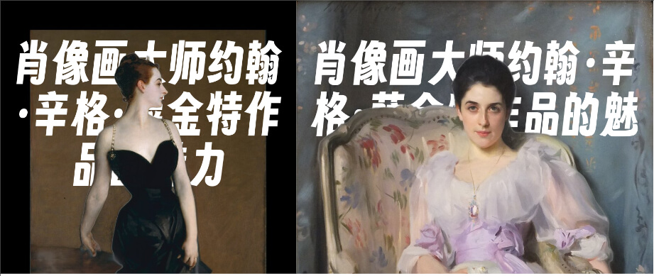

# simple-draw-text-behind-image
Draw text behind image with RMBG-1.4 + cv2 + Pillow

<a href="https://odoo.metaerp.ai/" target="_blank" rel="noopener">
  <picture>
    <source media="(prefers-color-scheme: dark)" alt="Banner" srcset="./docs/banner.jpeg" />
    
  </picture>
</a>

## 介绍
用Python实现的在图片背后创建文字的小工具。

## 受以下项目启发
[text-behind-image](https://github.com/RexanWONG/text-behind-image)


## 特性
- 移除图片背景
- 在图片背后创建指定的文字，并合成新图片


## 快速开始

1. 克隆本项目:

   ```bash
   git clone https://github.com/glovebx/simple-draw-text-behind-image
   cd simple-draw-text-behind-image
   ```

2. 安装依赖:
   ```bash
   pip install -r requirements.txt
   ```

## 使用方法

1. 将要处理的图片放到本目录下，文件名为`background.jpg`:
2. 运行脚本
   ```bash
   python simple_draw_test_behind_image.py
   ```

## 贡献
我们欢迎各类贡献。如果你有新的功能或改进，欢迎提交 PR：
1. Fork 本项目。
2. 创建新的分支 (git checkout -b feature/your-feature)。
3. 提交修改 (git commit -m 'Add some feature')。
4. 推送到分支 (git push origin feature/your-feature)。
5. 创建 Pull Request。

## 许可证
本项目基于 [MIT license](https://opensource.org/licenses/MIT) 开源。